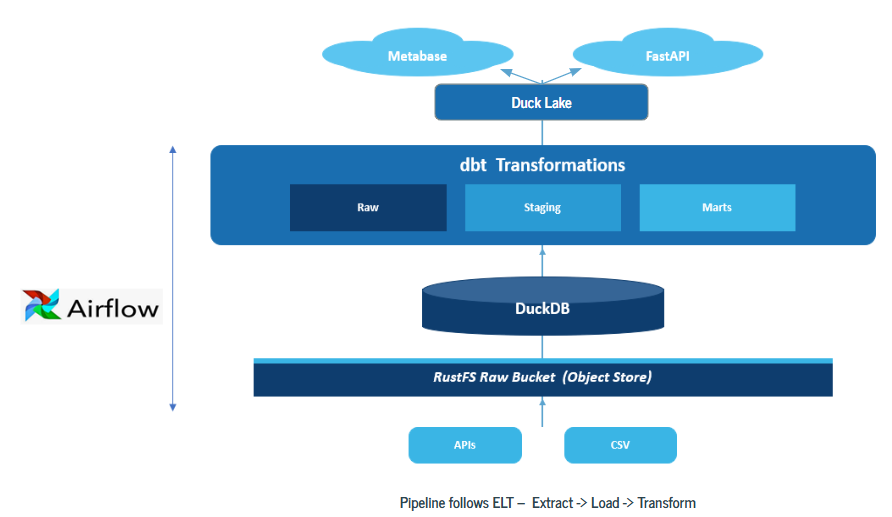

# Medicare Physicians and Inpatient Analytics Pipeline 

## Project Overview

This project builds a **production-ready, end-to-end data engineering pipeline** for Medicare claims data published by the Centers for Medicare & Medicaid Services (CMS).

The goal is to **transform raw, paginated API data into actionable analytics** — enabling healthcare researchers, policymakers, and analysts to understand Medicare payment patterns, physician billing behavior, and hospital cost disparities across the United States.

The pipeline is built to:

- Ingest large-scale Medicare datasets (up to 9.6M rows) from the CMS public API with memory-efficient, chunked processing
- Store raw parquet data in an S3-compatible data lake (RustFS) for durability and replayability
- Clean and transform data through a layered architecture (Raw → Marts → Gold)
- Serve insights through Metabase dashboards and a FastAPI REST API
- Run automatically on a schedule via Apache Airflow, containerized with Docker

---

## Data Sources

**Medicare Inpatient Hospitals — by Provider and Service (CMS)**
- Hospital-level charges, Medicare payments, and discharge volumes organized by DRG code
- ~145,000 rows covering all US IPPS hospitals
- [CMS Dataset](https://data.cms.gov/provider-summary-by-type-of-service/medicare-inpatient-hospitals)

**Medicare Physician and Other Practitioners — by Provider and Service (CMS)**
- Physician-level services, HCPCS procedure codes, and Medicare payment amounts
- 9.6M total rows — 500k loaded (configurable via `.env`)
- [CMS Dataset](https://data.cms.gov/provider-summary-by-type-of-service/medicare-physician-other-practitioners)

---

## Pipeline Architecture

```



```

**Orchestration:** Apache Airflow DAG runs the full pipeline end-to-end

**Infrastructure:** Docker Compose — Airflow, RustFS, Metabase in one stack

**CI/CD:** GitHub Actions runs pytest on every push to `dev` and `main`

---

## Architecture Layers

### 1. Ingestion — CMS API to RustFS

Raw data is fetched from the CMS API using a production-ready ingestion layer:

- **Pagination** — 5,000 rows per API request, offset-based
- **Polars over Pandas** — 5-10x faster processing, lower memory footprint
- **Chunked uploads** — Every 100k rows written to RustFS as a new part file and released from memory immediately. No giant in-memory accumulation
- **Exponential backoff** — 5 retries with increasing wait times on any network failure
- **Rate limiting** — 1 second sleep between API calls to respect CMS limits
- **Configurable row limit** — `PHYSICIAN_MAX_ROWS` in `.env` controls how much of the 9.6M physician dataset to ingest

### 2. Raw Layer — RustFS to DuckDB

Multi-part parquet files are loaded into DuckDB's raw schema:

- `get_latest_prefix()` automatically detects the most recently uploaded date folder — handles midnight edge cases cleanly
- Each part file is read and inserted into staging one at a time — flat memory usage regardless of part count
- **Staging + MERGE pattern** — all parts land in staging, then a single SQL MERGE upserts into the final table. Fully idempotent on re-runs

| Table | Description |
|-------|-------------|
| `raw.inpatient_hospitals` | Final inpatient data — primary key: CCN + DRG code |
| `raw.stg_inpatient_hospitals` | Staging table for MERGE |
| `raw.physician_data` | Final physician data — primary key: NPI + HCPCS + place of service |
| `raw.stg_physician_data` | Staging table for MERGE |

### 3. Transformation — dbt

dbt models clean and enrich the raw CMS data:

- Renames raw CMS column names (e.g. `Rndrng_Prvdr_CCN`) to readable snake_case
- Casts string columns to correct numeric types
- Computes derived metrics:
  - `payment_gap` — difference between submitted charges and Medicare payment
  - `medicare_coverage_pct` — Medicare payment as a percentage of submitted charges
- `mart_inpatient` — 145,301 rows
- `mart_physician` — 499,591 rows

### 4. Gold Layer — DuckLake

dbt mart tables are loaded into DuckLake for the serving layer:

- MERGE pattern creates one clean snapshot per pipeline run
- `gold_inpatient` and `gold_physician` with full lakehouse versioning
- Absolute path configuration for stable Docker deployments

---

## Why This Pipeline Matters

- **Scale** — Handles 9.6M row datasets with production-grade memory management. Architecture scales to the full dataset with a single config change
- **Portability** — RustFS is S3-compatible. Switching to AWS S3 or GCS requires only a `.env` update — zero code changes
- **Reproducibility** — Staging + MERGE pattern makes every pipeline run idempotent. Re-runs never create duplicates
- **Dual serving** — Metabase for business users, FastAPI for developers and downstream applications. Two data products from one pipeline

---

## Insights Delivered

- Average Medicare payment and payment gap by US state
- Top DRG procedures by hospital discharge volume
- Inpatient cost comparison — urban vs. rural hospitals (RUCA classification)
- Physician billing patterns by specialty and HCPCS code
- Medicare coverage percentage across provider types and geographies

---

## Technologies Used

| Category | Tool | Purpose |
|----------|------|---------|
| Ingestion | Python + Polars | Memory-efficient chunked API ingestion |
| Object Storage | RustFS (S3-compatible) | Raw data lake — parquet part files |
| Warehouse | DuckDB | Raw schema, staging, final tables |
| Transformation | dbt-duckdb | Mart models, column cleaning, derived metrics |
| Lakehouse | DuckLake | Gold layer with snapshots and MERGE |
| Orchestration | Apache Airflow | Full DAG pipeline orchestration |
| Visualization | Metabase | Business dashboards |
| API | FastAPI + Pydantic | REST endpoints on dbt marts |
| Containerization | Docker Compose | Full stack deployment |
| CI/CD | GitHub Actions | pytest on every push |
| Config | pydantic-settings | Environment-based configuration |
| Logging | loguru | Structured pipeline logging |

---

## Getting Started

### Prerequisites

- Docker and Docker Compose
- Python 3.12+ with [uv](https://github.com/astral-sh/uv)

### 1. Clone the repository

```bash
git clone https://github.com/NSS-Data-Engineering-Oct2025/Capstone_Medicare_Praveena_DE.git
cd Capstone_Medicare_Praveena_DE
```

### 2. Configure environment variables

```bash
cp .env.example .env
```

Fill in your credentials — see `.env.example` for all required fields.

### 3. Start the Docker stack

```bash
docker compose up -d
```

| Service | URL |
|---------|-----|
| Airflow | http://localhost:8080 |
| RustFS | http://localhost:9001 |
| Metabase | http://localhost:3000 |

### 4. Initialize DuckDB — run once

```bash
uv run python -m scripts.database_init
```

### 5. Trigger the pipeline

Open Airflow at `http://localhost:8080`, find `medicare_pipeline`, and click **Trigger DAG**.

---

## Running the Pipeline Manually

```bash
# Step 1 — Fetch from CMS API and upload to RustFS
uv run python -m src.upload_to_rustfs.api1_inpatient_data
uv run python -m src.upload_to_rustfs.api2_physician_data

# Step 2 — Load RustFS parquet files into DuckDB raw schema
uv run python -m src.ingestion.api1_inpatient_to_duckdb
uv run python -m src.ingestion.api2_physicians_to_duckdb

# Step 3 — Run dbt transformations
cd medicare_dbt && dbt run

# Step 4 — Load gold layer into DuckLake
uv run python -m lakehouse.ducklake_loader
```

---

## API Endpoints

FastAPI runs at `http://localhost:8000`. Interactive docs available at `/docs`.

| Endpoint | Description |
|----------|-------------|
| `GET /api/v1/inpatient/state/{state_code}` | Inpatient summary for a state (e.g. TX, CA, NY) |
| `GET /api/v1/inpatient/top-drg?limit=10` | Top DRG procedures by discharge volume |
| `GET /api/v1/inpatient/payment-gap` | Average payment gap by state |
| `GET /api/v1/inpatient/urban-rural` | Medicare payments by RUCA urban/rural classification |

---

## Running Tests

```bash
uv run pytest tests/ -v
```

Tests use `unittest.mock` to intercept all API calls — no real network requests or credentials needed in CI.

---

## Stretch Goals and Future Work

- Add NPI enrichment joining physician data to the NPI registry for deeper provider profiling
- Implement data freshness checks comparing CMS dataset row counts before triggering ingestion
- Expand to the Medicare Outpatient dataset for inpatient vs. outpatient cost comparison
- Add physician endpoints to FastAPI for programmatic access to `mart_physician`
- Deploy FastAPI to cloud (AWS Lambda or GCP Cloud Run) for public API access

---

## Acknowledgments

- Centers for Medicare & Medicaid Services (CMS) — [data.cms.gov](https://data.cms.gov)
- NSS Data Engineering Cohort — Oct 2025